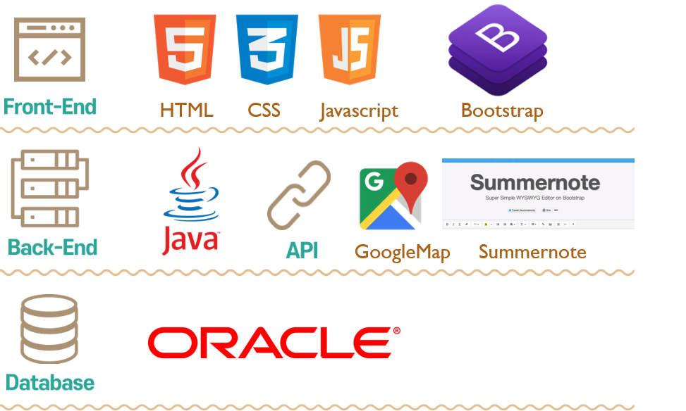

# ABOUT PROJECT
#### [ GalleryKAS ] Développement Site Web : Site de Gallery ART, Recommandation d'exhibitions, Forum de partage expériences  *( 2020.07.01 ~ 2020.07.08 )*

## 1. Membres de l'équipe

|*Members*|*Contact*|
|:---:|---|
|**Joohyun ANN**| |
|**Jihee SEO**| |
|**Hyungsub Kim**| |

## 2. Installation du projet
1. Copier Code Github 
2. Connexion Apache Tomcat ( v9.0 ) 
3. Import Projet
4. Connexion DB ORACLE Server
   1. Exécution SQL (src/main/webapp/WEB-INF/views/sql/)
      1. create.sql
      2. insert.sql
   2. Adapation de Paramètres
      1. root-context.xml
        1. jdbcUrl
        2. username
        3. password
      2. package : GalleyKAS.setting.Path
        1. path pour UploadFiles
6. Exécution du Tomcat Server
   
## 3. Présentation du projet
&nbsp; Afin de pratiquer **MVC Pattern**, trois développeurs ont réalisé un site de Gallery d'Art pendant une semaine. **Listes des exhibitions recommndées**, ainsi qu'un **forum de discussion** pour partager l'expériences des expositions présentées sont à disposition. 

## 4. Technologie 

# Results
## 1. Résultat
### *Main Page*
  

 
&nbsp;Présentation des deux services que l'on offre ; **Recommandation d'exhibitions**, **Forum**

---

### *Artists*

 
&nbsp; Liste des noms d'artists que l'on recommande sont à disposition. Lors que l'on touche le nom d'artiste, le poster de l'artiste s'affiche à droite grâce à javascript(jquery).   

### *Review*

 
&nbsp; Un forum de discussion permet de discuter les expériences sur les expositions présentées.   

---

### *Search*

 
&nbsp; Le bar de recherche permet de trouver facilement une exhibition que l'on cherche.   

---

### *About*

 
&nbsp;La page About présente de quoi s'agit le projet, et les informations complémentaires.

---

